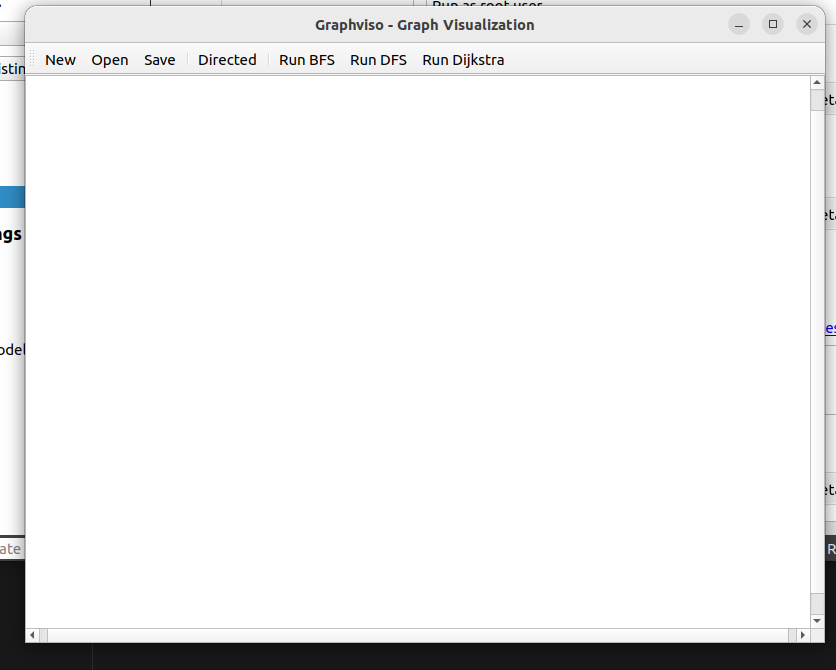
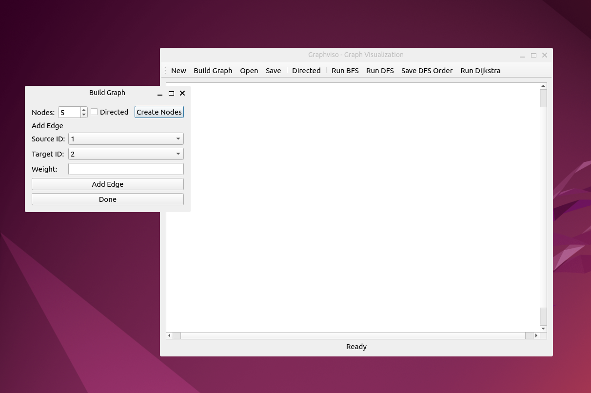
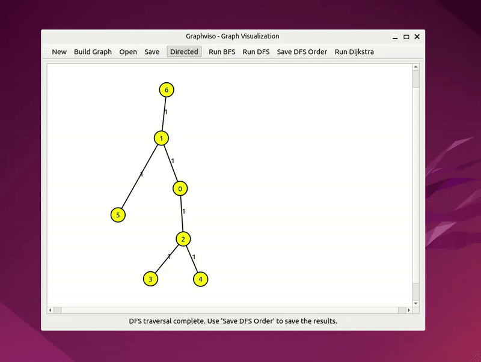
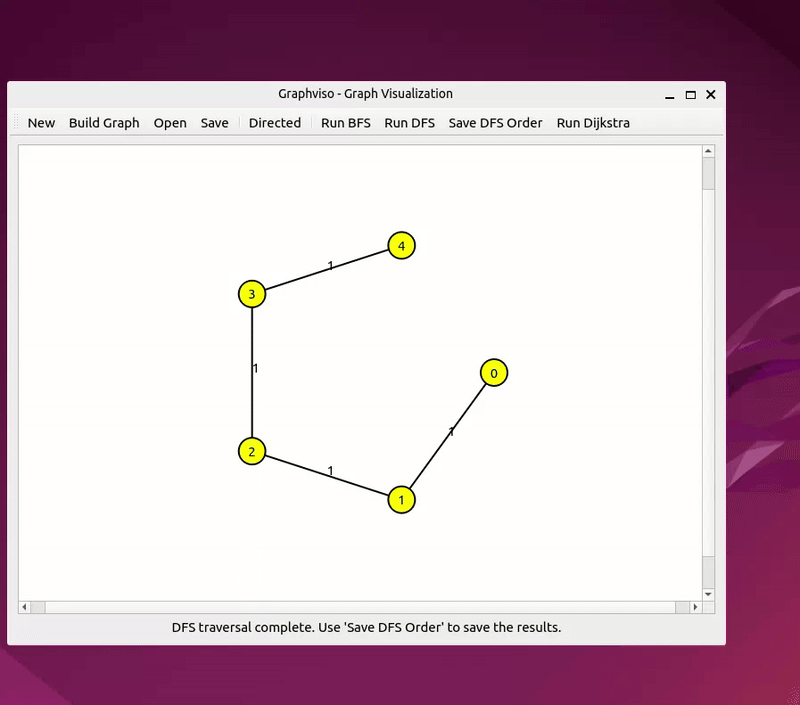

# Graphviso - Interactive Graph Algorithm Visualization



A **C++/Qt application** for creating, editing, and visualizing graph algorithms in real-time. Designed to help competitive programmers and students solve graph problems in programming contests efficiently.

##  Purpose

Graphviso is a powerful tool for **competitive programming and algorithm problem-solving**, enabling you to:
- Quickly prototype and test graph solutions
- Visualize algorithm execution step-by-step
- Experiment with different graph structures
- Verify correctness before submitting to contests

Perfect for practice on platforms like **Codeforces, LeetCode, AtCoder, and ICPC**.

##  Features

### Graph Building
- **Interactive drag & drop** node creation
- **Visual graph editor** with add/remove nodes and edges
- Support for **directed and undirected graphs**
- **Weighted edges** for Dijkstra and weighted path problems

### Algorithm Visualizations
- **Breadth-First Search (BFS)** - Green node highlighting with step-by-step animation
- **Depth-First Search (DFS)** - Yellow node traversal with full component exploration
- **Dijkstra's Shortest Path** - Interactive start/end selection with edge relaxation visualization

### Interactive Features
- **Step-by-step animation** for all algorithms
- **Save/Load graphs** for reuse and testing
- **Export algorithm outputs** (DFS order, BFS order, shortest path)
- Clean, intuitive Qt GUI

---

##  Prerequisites

- **C++ compiler** with C++17 support
- **Qt 6.x** development package
- **CMake 3.16** or higher
- **Linux/macOS/Windows** (cross-platform compatible)

---

##  Building the Project

### Step 1: Install Dependencies

**Ubuntu/Debian:**
```bash
sudo apt-get install build-essential cmake qt6-base-dev qt6-tools-dev
```

### Step 2: Build

```bash
mkdir -p build
cd build
cmake ..
make -j$(nproc)
```

### Step 3: Run

```bash
./src/graphviso
```

---

## Project Structure

```
graphviso/
├── include/                # Header files
│   ├── core/              # Core graph data structures (Graph, Node, Edge)
│   ├── algorithms/        # Algorithm implementations (BFS, DFS, Dijkstra)
│   ├── gui/               # Qt GUI components (MainWindow, NodeItem, EdgeItem)
│   └── utils/             # Utility functions
├── src/                   # Implementation files
├── tests/                 # Unit tests for algorithms
├── assets/                # GIFs and images
│   ├── BFS.gif            # BFS visualization demo
│   ├── DFS.gif            # DFS visualization demo
│   ├── Dijkstra.gif       # Dijkstra's algorithm demo
│   ├── BuildGraph.png     # Graph building interface
│   └── UI.png             # Application UI screenshot
├── resources/             # Qt resources and icons
├── CMakeLists.txt         # CMake build configuration
└── .gitignore             # Git ignore rules
```

---

##  Usage Guide

### Creating a Graph

1. **Add Nodes:** Click "Add Node" and drag to place nodes on the canvas
2. **Connect Nodes:** Use "Add Edge" → click source node → click target node → enter weight (if needed)
3. **Save Graph:** Use File → Save for later use

### Application Interface



### Running Algorithms
  
#### BFS Visualization
- Select starting node
- Click "Run BFS"
- Watch nodes turn green as they're discovered
- Use step controls to advance through the traversal

#### DFS Visualization
  
- Select starting node
- Click "Run DFS"
- Nodes highlight in yellow as they're explored
- Traverse all connected components
- Export DFS order for contest solutions

#### Dijkstra's Shortest Path

- Click "Run Dijkstra"
- Select source node
- Select destination node
- Watch edge relaxations highlight
- Final shortest path is highlighted


---

##  Algorithm Details

### Breadth-First Search (BFS)
- **Time Complexity:** O(V + E)
- **Use Case:** Shortest path in unweighted graphs, level-order traversal
- **Visualization:** Green node highlighting

### Depth-First Search (DFS)
- **Time Complexity:** O(V + E)
- **Use Case:** Topological sort, cycle detection, connected components
- **Visualization:** Yellow node highlighting with backtracking

### Dijkstra's Algorithm
- **Time Complexity:** O((V + E) log V) with min-heap
- **Use Case:** Shortest path in weighted graphs (non-negative weights)
- **Visualization:** Edge relaxation steps and final path highlight

---

##  Next Steps & Enhancements

### High Priority
-  **Interactive edge creation** - Click source → target for faster graph building
-  **Playback controls** - Play/Pause/Step/Speed for better visualization control
-  **Unit tests** - Algorithm correctness validation and regression testing

### Medium Priority
-   **Separate export formats** - JSON/CSV output for DFS/BFS/Dijkstra results
-   **Scene editing improvements** - Select/delete nodes/edges, edit weights
-  **Undo/Redo support** - Better workflow for rapid prototyping

### Nice to Have
-   Additional algorithms (Kruskal's, Prim's, Bellman-Ford)
-   Dark mode support
-   Keyboard shortcuts
-   Graph statistics dashboard

---

##  Testing

Run unit tests for algorithm implementations:

```bash
cd build
ctest --verbose
```

---

##  Contributing

Found a bug or want to suggest a feature? Feel free to:
1. Report issues
2. Submit pull requests with improvements
3. Share your algorithm visualizations

---

##  License

This project is designed for educational and competitive programming practice.

---

##  Quick Tips for Contest Prep

- **Pre-build common graph patterns** and save them for quick testing
- **Use step-by-step mode** to verify your algorithm logic before coding
- **Export algorithm outputs** to validate against test cases
- **Combine multiple algorithms** - visualize DFS to find components, then Dijkstra between them
